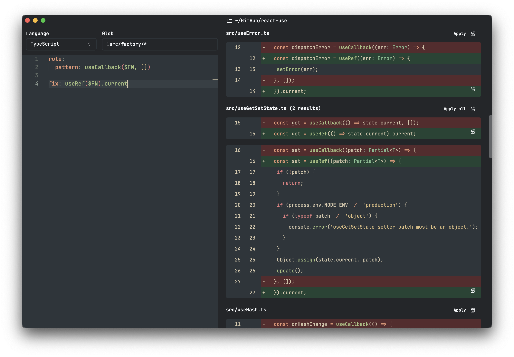

# SG GUI

This repo is still in early days, but its goal is to provide a GUI on top of [the amazing ast-grep](https://ast-grep.github.io/).

It aims to expose as much of the `sg scan` functionality from AST-GREP as possible but display results in a beautiful web GUI that's easy to use and allow for easy experimentation with rewrites (that can be applied one "chunk" at a time).

This project started as an experiment for me to learn more about Tauri and Rust, so don't expect perfection here.

## TODO:

- [ ] Perf improvements:
  - [ ] Some sort of inf scroll, if there are thousands of results, need to be able to handle that.
- [ ] Ellispis if in thousands for line number
- [ ] Error handling for when sg scan fails
- [ ] Need to do replacements based on offsets not the text itself

## FUTURE IMPROVEMENTS

- [ ] Character diffs, showing which characters in line changed. (E.g. whitespace changes sg seems to randomly pick up)
- [ ] View full file diff – similar code diff logic, just grab whole file contents and do the diff.
- [ ] Infer the language from glob?
